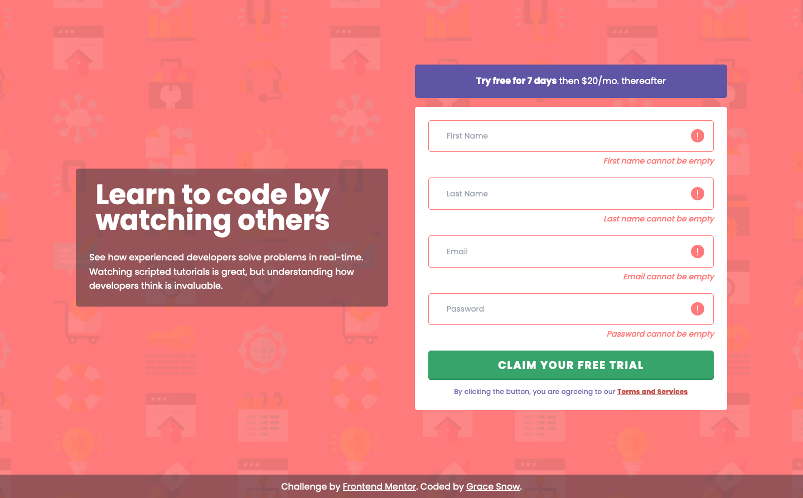

# Frontend Mentor - Intro component with sign up form solution

This is a solution to the [Intro component with sign up form challenge on Frontend Mentor](https://www.frontendmentor.io/challenges/intro-component-with-signup-form-5cf91bd49edda32581d28fd1). Frontend Mentor challenges help you improve your coding skills by building realistic projects.

**This is my first project using React.** I found it hard, particularly choosing where to split the components and make them reusable

## Table of contents

- [Overview](#overview)
  - [The challenge](#the-challenge)
  - [Screenshot](#screenshot)
  - [Links](#links)
- [My process](#my-process)
  - [Built with](#built-with)
  - [What I learned](#what-i-learned)
  - [Continued development](#continued-development)
  - [Useful resources](#useful-resources)
- [Author](#author)
- [Acknowledgments](#acknowledgments)

## Note on Accessibility

There are some known issues with this design. Specifically:

- Labels are not visible (placeholders acting as labels)
- Password Criteria is not shown to users up front
- Color contrast issues throughout
- Acceptance of Terms appearing _after_ the form's submit button. (It's also a legal failure under GDPR to not have an explicit opt in to terms.)
- Font sizes illegibly small
- Missing underlines on links

I have mitigated against these issues as best I can by

- adjusting colors
- adding backgrounds that were not in the original design
- increasing font sizes
- using aria-describedby to programmatically link errors and hint text,
- underlining links

## Overview

### Acceptance Criteria

Users should be able to:

- View the optimal layout for the site depending on their device's screen size
- See hover and focus-visible states for all interactive elements on the page
- Receive an error message when the `form` is submitted if:
  - Any `input` field is empty. The message for this error should say _"[Field Name] cannot be empty"_
  - The email address is not formatted correctly (i.e. a correct email address should have this structure: `name@host.tld`). The message for this error should say _"Looks like this is not an email"_

In addition, I added some password format validation, aria-live regions and focus-visible outlines.

### Screenshot

### Links

- Solution URL: [Add solution URL here](https://your-solution-url.com)
- Live Site URL: [Add live site URL here](https://your-live-site-url.com)

## My process

### Built with

- [React](https://reactjs.org/)
- [React Hook Forms](https://react-hook-form.com/)
- [Tailwind CSS](https://tailwindcss.com/) - custom configuration
- Semantically meaningful HTML
- CSS custom properties
- Flexbox
- CSS Grid
- Mobile-first workflow
- - JS library
- [Next.js](https://nextjs.org/) - React framework
- [Styled Components](https://styled-components.com/) - For styles

**Note: These are just examples. Delete this note and replace the list above with your own choices**

### What I learned

The form validation was tough on this.

First I tried to do it all myself using vanilla JS and React.useState to manage all of the input validation. It felt overly complicated and seemed to be causing unnecessary re-renders so I switched to React Hook Forms part way through the challenge.

I am aware I may not be using React Hook Forms in the best way yet, as I only had a brief read of the documentation. I'm imagining this would be a site with content managed fields, so I have kept error message content in its own object.

Overall, I'm happy with the progress I've made here. I've only just started dipping into a React course, and hadn't used Tailwind before either.

### Continued development

1. The form would benefit from using seperate form elements, each type as their own component, which could be re-used in other forms.
2. Similarly, any shared validation rules or regexes would be good to extract into a central location for better reuse.
3. Ideally, I'd like to improve the form validation further, showing each relevant password error bullet point when specific parts of the current regex fail.
4. I didn't love Tailwind in this project and would like to explore CSS modules, Cube CSS or perhaps tailwind @apply directives to create some common styles.

## Author

- My Front End Development Blog - [FED Mentor](https://fedMentor.dev)
- Frontend Mentor - [@grace-snow](https://www.frontendmentor.io/profile/grace-snow)
- Twitter - [@gracesnow](https://www.twitter.com/gracesnow)
